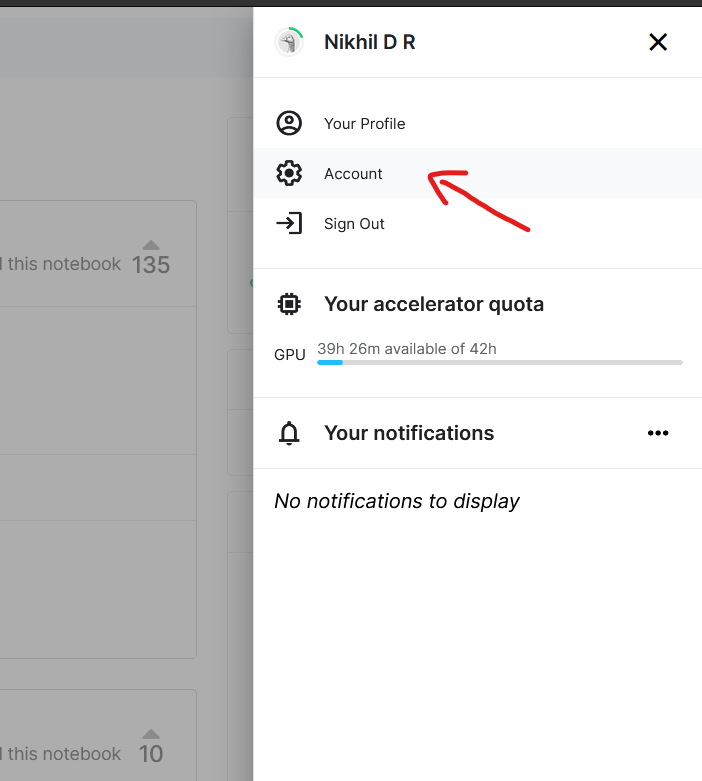
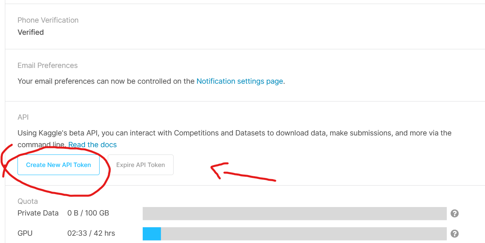
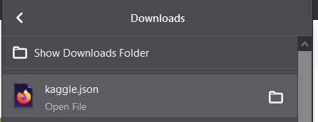
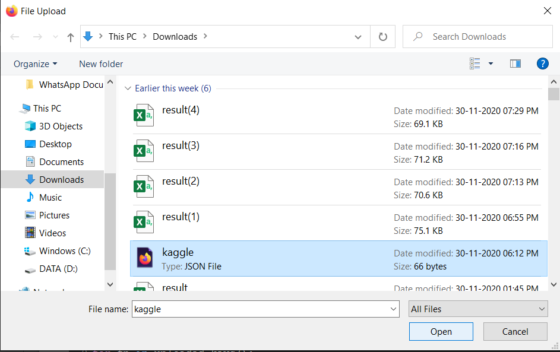
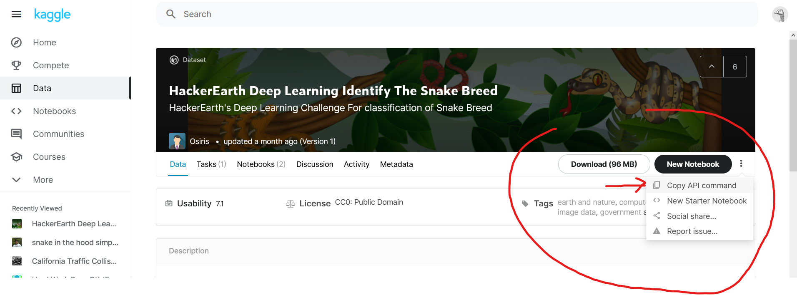

# Kaggle-to-Google-Colab
## goto your kaggle account settings

## Scroll down to generate and get kaggle API 

## kaggle.json file will be downloaded 
## upload the json file to the google colab notebook when prompted

## Now, navigate to the Dataset of your interest in the Kaggle,
## and In the dataset page Click on Three dots on the right side and Click on "COPY API COMMAND"

## paste this api command in the notebook when asked
